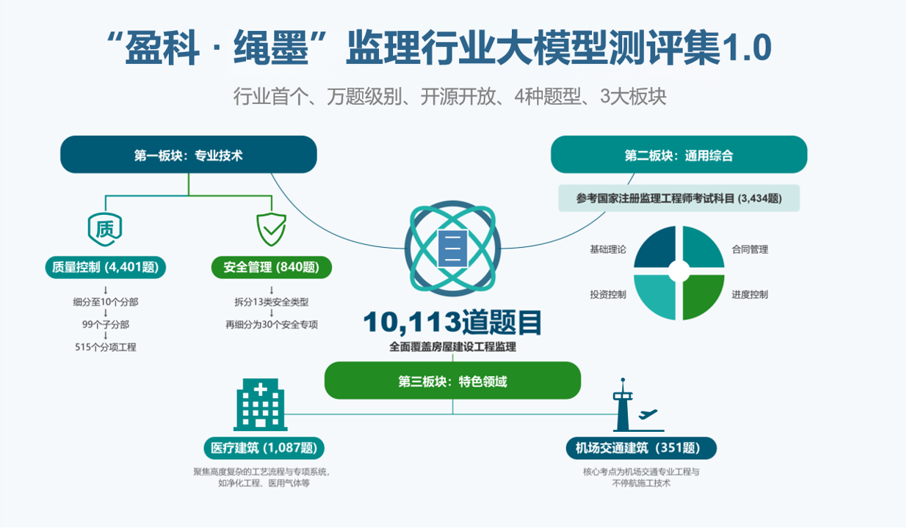
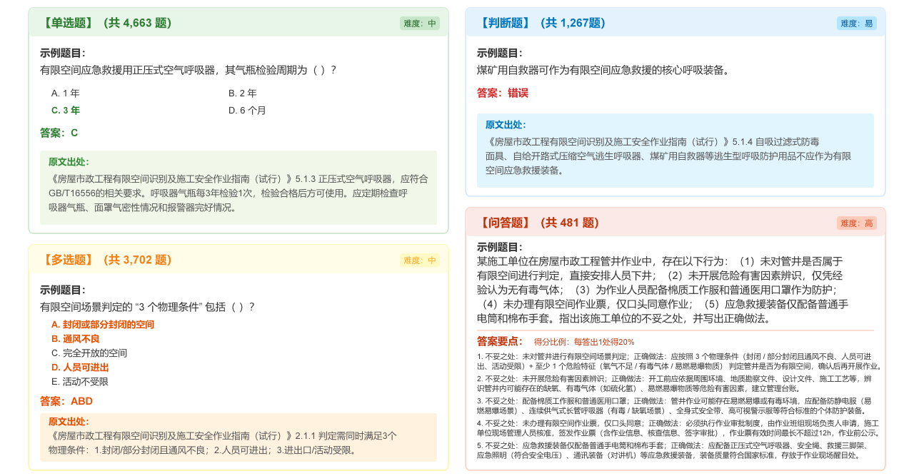
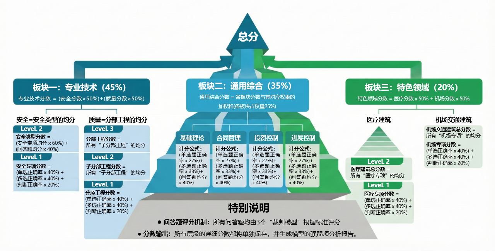

# MESBench 1.0

<p align="center">
  
</p>

## Introduction
This project aims to build a comprehensive evaluation framework for Large Language Models (LLMs) in the field of construction supervision. It automates the assessment of models' professional knowledge in areas such as Safety, Quality, General Comprehensive, and Special Scenes (e.g., Medical, Airport), producing detailed score statistics and analysis reports.

## Overall Framework


## Question Examples


## Scoring Mechanism


## Directory Structure
- `data/`: Evaluation datasets (Professional Technology, General Comprehensive, Special Scenes, etc.).
- `frame/`: Knowledge framework definitions.
- `config/`: Configuration files.
- `pipeline/`: Core processing logic.
- `results/`: Output directory for evaluation results.

## Installation and Usage

### 1. Install Dependencies
Ensure you have a Python environment set up, then install the required packages:
```bash
pip install -r requirements.txt
```

### 2. Run Evaluation
Run the evaluation using the default configuration (`config/test.yaml`):
```bash
python main.py
```
Or specify a custom configuration file:
```bash
python main.py --config_yaml_path config/your_config.yaml
```

### 3. Dataset Validation
Before running the evaluation, you can validate the integrity of the dataset (e.g., check if necessary question types exist for each category):
```bash
python main.py --validate_dataset
```

## Configuration
The configuration file (e.g., `config/test.yaml`) includes:
- **candidate_model**: Parameters for the model to be evaluated (api_key, base_url, model_name, etc.).
- **judges**: List of judge models (used for scoring QA questions).
- **datasets_config_path**: Path to the dataset selection file (.txt) defining the scope of questions.
- **result_output_path**: Directory for output results.
- **weights**: Scoring weights for different question types.

## Evaluation Process
1. **Initialization**: Validate the availability of candidate and judge models.
2. **Data Loading**: Load the specified questions based on the configuration.
3. **Model Inference**: Concurrently call the candidate model to generate answers.
4. **Scoring**:
   - Objective questions (Single/Multi-choice, True/False): Automatically scored against standard answers.
   - Subjective questions (QA): Scored by judge models (e.g., GPT-4).
5. **Report Generation**: Output `scores.csv` (detailed scores) and `report.md` (analysis report).

## Notes
- `data/` and `frame/` directories contain source data and usually do not need modification.
- Results are saved in the `results/` directory (or the path specified in the config).
- If no valid judge model is configured, QA questions will not be included in the final score.
