<p align="center">
  
  <br>
</p>

# JKinco-MESBench 1.5

<p align="center">
  <a href="https://github.com/2719104587/MESBench">
    
  </a>
  <a href="https://www.modelscope.cn/datasets/DongZekai/Norma_MESBench_1.0">
    
  </a>
</p>


## Table of Contents
- [Introduction](#introduction)
- [Changelog](#changelog)
- [Overall Framework](#overall-framework)
- [Dataset Construction Method](#dataset-construction-method)
- [Question Examples](#question-examples)
- [Scoring Mechanism](#scoring-mechanism)
- [Model Evaluation Result Analysis](#model-evaluation-result-analysis)
- [Directory Structure](#directory-structure)
- [Installation and Usage](#installation-and-usage)
- [Configuration](#configuration)
- [Evaluation Process](#evaluation-process)
- [Notes](#notes)
- [License](#license)
- [Acknowledgements](#acknowledgements)

## Introduction
JKinco-MESBench 1.5 is the first 10,000-level multi-task LLM evaluation benchmark tailored for China's construction supervision industry. Focusing on housing construction, it contains 10,144 questions across Professional Technology, General Comprehensive, and Special Scenes, including single-choice, multiple-choice, true/false, and Q&A formats. By employing a "multi-level hybrid scoring mechanism," it comprehensively measures LLMs' professional capabilities. This project aims to help practitioners assess the accuracy and reliability of model outputs, addressing the lack of evaluation benchmarks in the supervision domain.

## Changelog

### 2026-04-13: Evaluation Set v1.5 Released
1. 369 new questions were added, all from the Professional Technology module.
2. The scoring rubric for Q&A questions was refined (the scoring points were split into finer-grained items), which led to a generally lower score for evaluated models.
3. The concurrency mechanisms for both candidate models and judge models were optimized, the testing speed has increased by 6 times.
4. A Heavy-Think evaluation mode was added.
5. Evaluation results for the latest models were added.
6. The project name was changed to “JKinco Zhuyan · Engineering Supervision LLM Evaluation Set”.

<p align="center">
  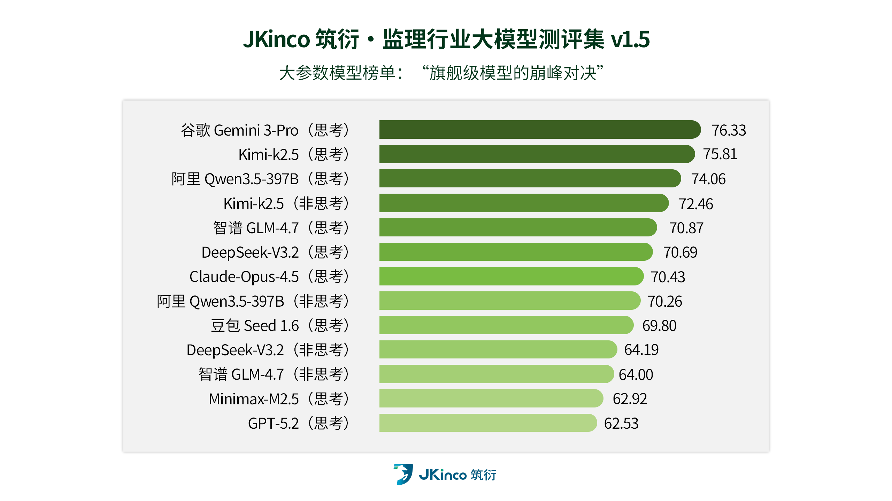
  <br>
  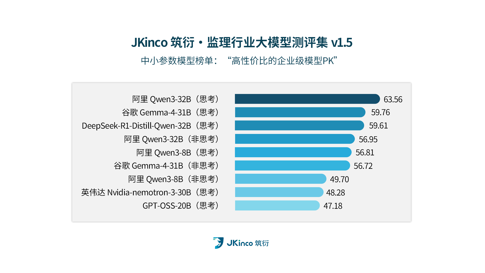
</p>

## Overall Framework
To comprehensively evaluate the professional capabilities of Large Language Models in the field of engineering supervision, MESBench has constructed a multi-dimensional evaluation structure containing 3 major sections and multiple levels, and further refined the granularity of evaluation based on the depth and breadth of supervision work.

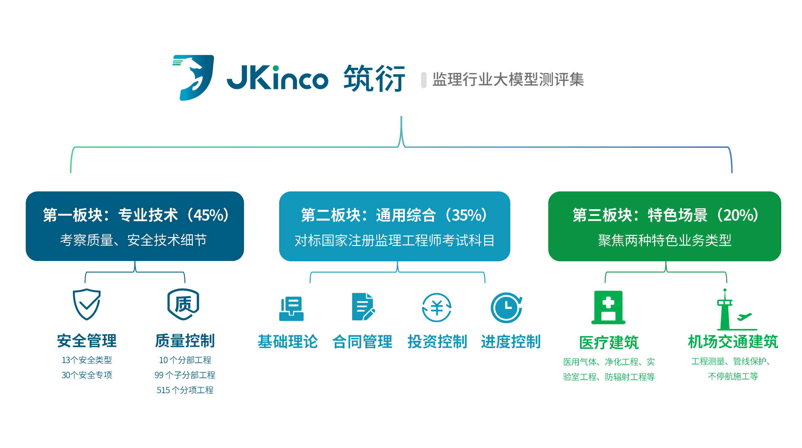

## Dataset Construction Method
The project adopts a hybrid mode of "Manual Questioning + LLM-assisted Questioning" to construct the evaluation set.

### 1. Manual Questioning
Authored by senior supervision professionals, providing "scenario questions", "correct answers", "references", and "specific options"/"scoring points".

### 2. LLM-assisted Questioning
- **RAG-based Generation**: Utilizing OCR and Embedding technologies to convert standards, management manuals, and other technical documents into a vector database. Questions are generated via Retrieval Augmented Generation (RAG) based on accurate references and verified manually.
- **Scenario Rewriting**: For questions from the National Certified Supervision Engineer Examination subjects, methods like shuffling options and scenario rewriting are used to reduce "memorization" and test actual problem-solving abilities.

### 3. Quality Control
- **Format Unification**: Scripts convert all questions into a unified JSON format.
- **Deduplication**: Based on semantic matching and vector similarity calculation.
- **Distribution Check**: Ensuring sufficient questions for each evaluation unit. The dataset totals 10,144 questions, including 4,669 single-choice, 3,709 multiple-choice, 1,271 true/false, and 495 Q&A questions.
- **Quality Inspection**: Focusing on common errors across mainstream models to replace defective questions.

## Question Examples
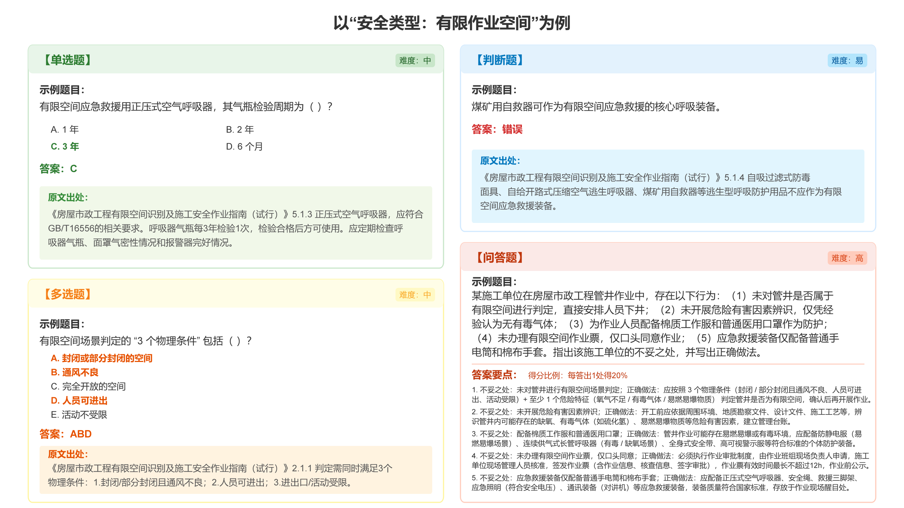

### Question Format Example
```json
    {
        "id": "45",
        "领域": "质量",
        "分部工程": "地基与基础",
        "子分部工程": "地下水控制",
        "分项工程": "降水与排水",
        "题型": "单选题",
        "问题": "分层、分块开挖的土质基坑，开挖前潜水水位应控制在土层开挖面以下多少范围\nA. 1.5m～2.0m\nB. 1.0m～1.5m\nC. 0.5m～1.0m\nD. 0.3m～0.5m\n",
        "答案": "C"
    },
```

## Scoring Mechanism
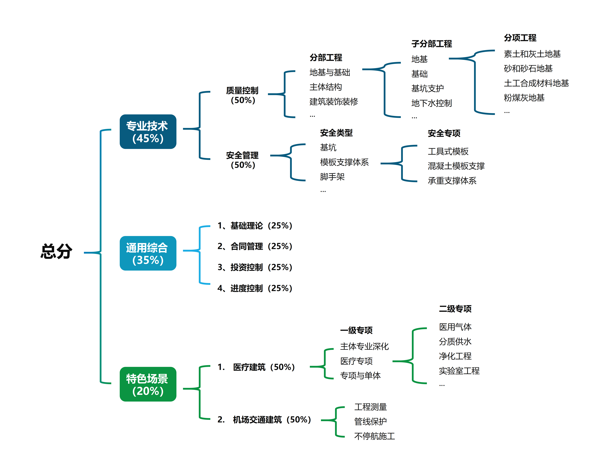

### 1. Overall Calculation Logic
To scientifically evaluate the professional level of models in various supervision sub-fields, this project proposes a "Multi-level Multi-type Hybrid Scoring Mechanism".

#### Total Score Calculation
The total score is a weighted sum of three major sections:

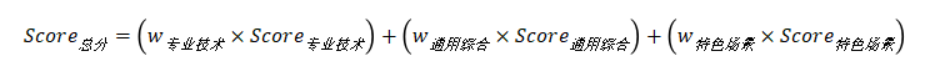

#### Section 1: Professional Technology (Weight 0.45)
Composed of "Safety Management" and "Quality Control", each accounting for 50%.
- **Safety Management**: Calculated hierarchically from "Safety Specials" and "Safety Types".
- **Quality Control**: Calculated hierarchically from "Sub-item Projects", "Sub-division Projects", and "Division Projects".

#### Section 2: General Comprehensive (Weight 0.35)
Includes "Basic Theory", "Contract Management", "Investment Control", and "Schedule Control", each accounting for 25%.

#### Section 3: Special Scenes (Weight 0.2)
Composed of "Medical Architecture" and "Airport Traffic Architecture", each accounting for 50%, to deeply evaluate the knowledge reserve of high-barrier knowledge points in the two characteristic project types of medical architecture and airport traffic architecture, which are distinct from traditional housing construction supervision projects.

### 2. Standardized Answering Mode
Adopts Zero-shot and generative evaluation. No problem-solving templates are provided; only output formats are constrained.

### 3. Scoring Mechanism for Each Question Type
- **Objective Questions** (Single/Multi-choice, True/False): Scored by comparing with standard answers to calculate Accuracy.
- **Subjective Questions** (Q&A): Adopts a "Split Scoring Points + LLM Judge Group" mechanism. A judge group consisting of kimi-k2-thinking, deepseek-r1, and qwen3-235b-a22b-thinking-2507 scores independently based on scoring points, and the average is taken.

## Model Evaluation Result Analysis

### 1. Mainstream LLM Selection
22 mainstream LLMs were selected for evaluation (including models with/without deep thinking enabled), with parameters ranging from 8B to over 1000B, covering both open-source and closed-source models.
| Model Name | Support Deep Thinking | Parameters | Open Source |
| :--- | :--- | :--- | :--- |
| qwen3-8b | Yes | 8B | Yes |
| qwen3-8b | No | 8B | Yes |
| qwen3-30b-a3b-thinking-2507 | Yes | 30B (Total), 3B (Active) | Yes |
| qwen3-30b-a3b-instruct-2507 | No | 30B (Total), 3B (Active) | Yes |
| qwen3-32b | Yes | 32B | Yes |
| qwen3-32b | No | 32B | Yes |
| qwen3-235b-a22b-thinking-2507 | Yes | 235B (Total), 22B (Active) | Yes |
| qwen3-max | No | 1T (Total), 220B (Active) | No |
| qwen3-max | Yes | 1T (Total), 220B (Active) | No |
| qwen3.5-397b-a17b | No | 397B (Total), 17B (Active) | Yes |
| qwen3.5-397b-a17b | Yes | 397B (Total), 17B (Active) | Yes |
| deepseek-r1-distill-qwen-32b | Yes | 32B | Yes |
| glm-4.7 | Yes | 358B (Total), 32B (Active) | Yes |
| glm-4.7 | No | 358B (Total), 32B (Active) | Yes |
| kimi-k2 | Yes | 1T (Total), 32B (Active) | Yes |
| kimi-k2.5 | Yes | 1T (Total), 32B (Active) | Yes |
| kimi-k2.5 | No | 1T (Total), 32B (Active) | Yes |
| doubao-seed-1.6 | Yes | 230B (Total), 23B (Active) | No |
| deepseek-v3.2 | Yes | 671B (Total), 37B (Active) | Yes |
| deepseek-v3.2 | No | 671B (Total), 37B (Active) | Yes |
| deepseek-r1 | Yes | 671B (Total), 37B (Active) | Yes |
| minimax-m2.5 | Yes | 230B (Total), 10B (Active) | Yes |
| doubao-seed-1.6-lite | Yes | Not disclosed | No |
| gpt-oss-20b | Yes | 20B | Yes |
| gpt-oss-120b | Yes | 120B | Yes |
| nvidia-nemotron-3-30b-a3b | Yes | 30B (Total), 3B (Active) | Yes |
| gemma-4-31b-it | Yes | 31B | Yes |
| claude-opus-4.5 | Yes | >1T (Total), >100B (Active) | No |
| gpt-5.2 | Yes | Not disclosed | No |
| gemini-3-pro-preview | Yes | >1T (Total), >15B (Active) | No |

### 2. Large Parameter Model Leaderboard
This section compares models with over 100B parameters, providing both a total-score leaderboard and a detailed table with dimension- and task-level results.
- **Open-source models are highly competitive**: In the detailed >100B results table, Gemini-3-pro-preview ranks first with 76.33. The next two models—Kimi-k2.5 (75.81) and Qwen3.5_397B_A17B (74.06)—are open-source, forming a clear top tier of “one closed-source + two open-source”.
- **The second tier is tightly clustered with the first**: In the total-score leaderboard, Qwen3-max (Deep Thinking) scores 71.51, followed by GLM-4.7 (Deep Thinking) 70.87, DeepSeek-v3.2 (Deep Thinking) 70.69, Claude-opus-4.5 (Deep Thinking) 70.43, and doubao-seed-1.6 (Deep Thinking) 69.80. The second tier spans only 1.7 points.
- **Dimension pattern: general is easier than domain-specific**: For most models, “General Comprehensive” is notably higher than “Professional Technology” (e.g., Kimi-k2.5: 81.16 vs 72.59; Gemini: 81.93 vs 72.09), indicating that general reasoning is mature while supervision-specific rules and fine-grained constraints remain the main bottleneck.
- **Clear laggards exist**: GPT-5.2 scores 62.53 and MiniMax-M2.5 scores 62.92, significantly behind the main pack.

<p align="center">
  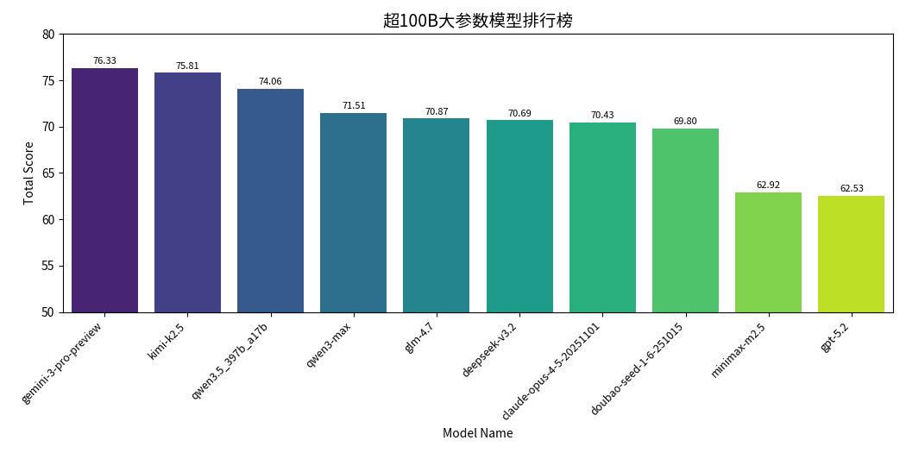
</p>
<p align="center">
  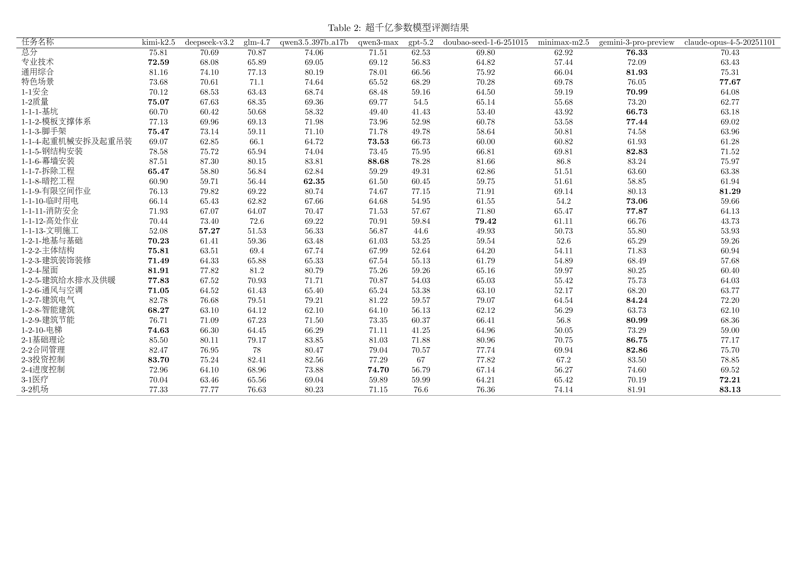
</p>

### 3. Small and Medium Parameter Model Leaderboard
Comparing open-source models with 8B-32B parameters, suitable for local deployment with limited resources.
- **Leapfrog performance**: Qwen3-32B (Deep Thinking) scores 63.56, leading the small/medium range and remaining competitive against some >100B models, making it a strong candidate for cost-effective local deployment.
- **Deep Thinking brings large gains at this scale**: Qwen3-32B improves from 56.95 (Non-Deep Thinking) to 63.56 (+6.6), showing CoT can meaningfully boost reasoning-heavy and composite tasks even under limited resources.
- **Foreign models have a clear “professional/quality” weakness**: The gap is largest in “Professional Technology / Quality Control” (e.g., GPT-OSS-20B: Professional Technology 39.64, Quality 34.58; Nemotron-30B: Professional Technology 40.46, Quality 36.49), reflecting difficulties with Chinese supervision codes and engineering context.
- **But “Special Scenes” is not one-sided**: Gemma-4-31B-IT scores 73.09 in Special Scenes and 82.14 on the Airport task, showing strong open-domain scene understanding; the biggest differences are concentrated in rule-heavy, fine-grained domain constraints.

<p align="center">
  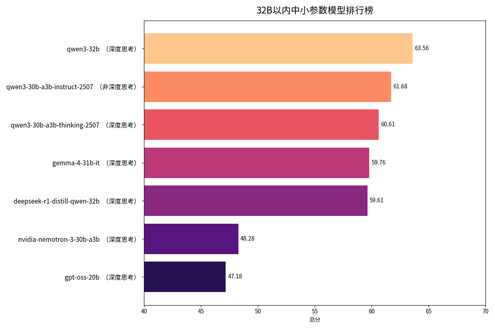
</p>
<p align="center">
  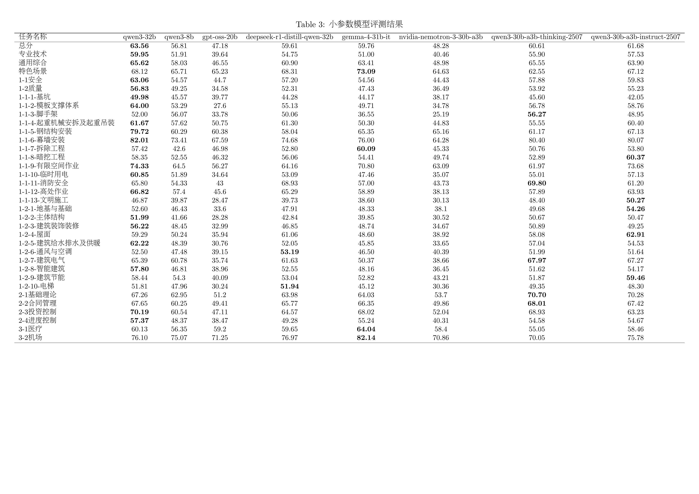
</p>

### 4. Thinking vs. Non-Thinking Mode
Scores of all models increase significantly after enabling "Deep Thinking (CoT)".
- **Significant improvements**: DeepSeek-v3.2 increases from 64.2 to 70.7 (+6.5), and GLM-4.7 from 64.0 to 70.9 (+6.9), the largest gains observed. Qwen3.5_397B_A17B (+3.8) and Kimi-k2.5 (+3.3) also improve consistently.
- **Most gains come from multi-step reasoning and domain inference**: For example, GLM-4.7 improves by 8.17 points in “General Comprehensive” (77.13 vs 68.96). DeepSeek-v3.2 improves by 6.78 / 5.19 points in “Professional Technology” and “General Comprehensive”, indicating CoT helps with stepwise deduction, rule mapping, and summarization tasks.
- **Cost of “slow thinking”**: CoT typically increases latency and cost. Use it for high-risk decisions and complex reasoning; use non-thinking mode for high-throughput or fast interaction scenarios.

<p align="center">
  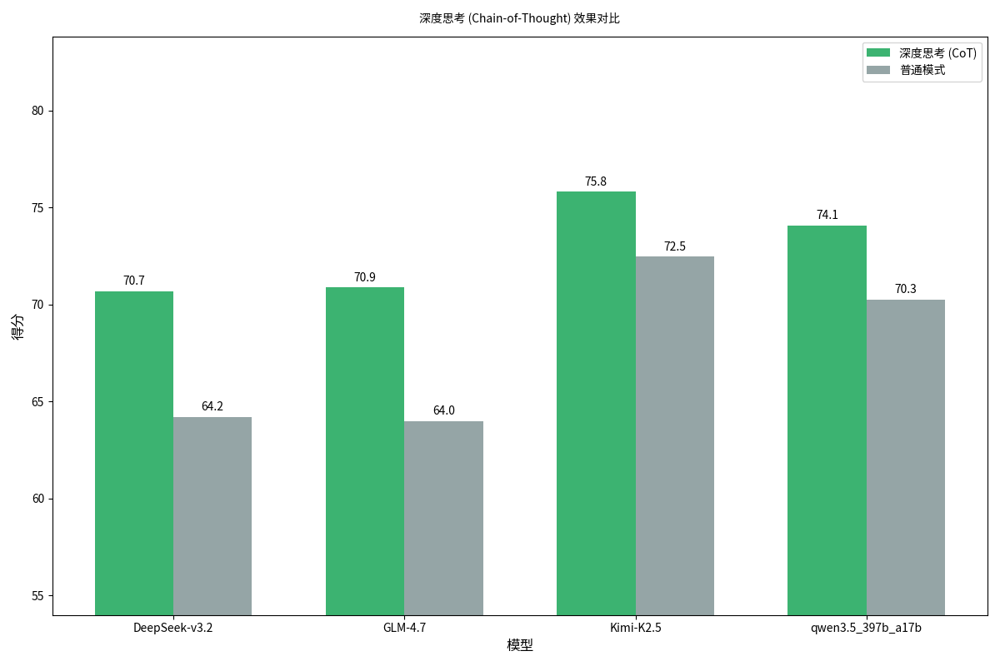
</p>
<p align="center">
  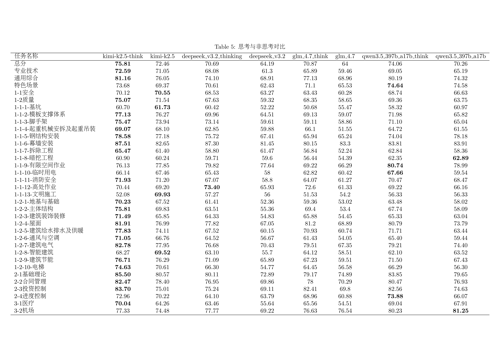
</p>

### 5. Score Comparison in Different Sub-fields (Taking Gemini-3-Pro-Preview as an Example)
- **Overall profile**: The average across fine-grained sub-fields is 70.7, showing a long-tail distribution where a few low-scoring topics drag down the mean.
- **Strengths: general + selected professional topics**: High-scoring tasks include Basic Theory (86.8), Electrical Engineering (84.2), Investment Control (83.5), Curtain Wall Installation (83.2), and Contract Management (82.9), suggesting strong performance on general knowledge, engineering common sense, and structured responses.
- **Weaknesses: safety rules and on-site management details**: Civilized Construction (55.8), Tunnel Excavation (58.9), and Hoisting & Lifting (61.9) are notably low, highlighting remaining gaps in fine-grained rule alignment, on-site experience reasoning, and code-level constraint satisfaction.

<p align="center">
  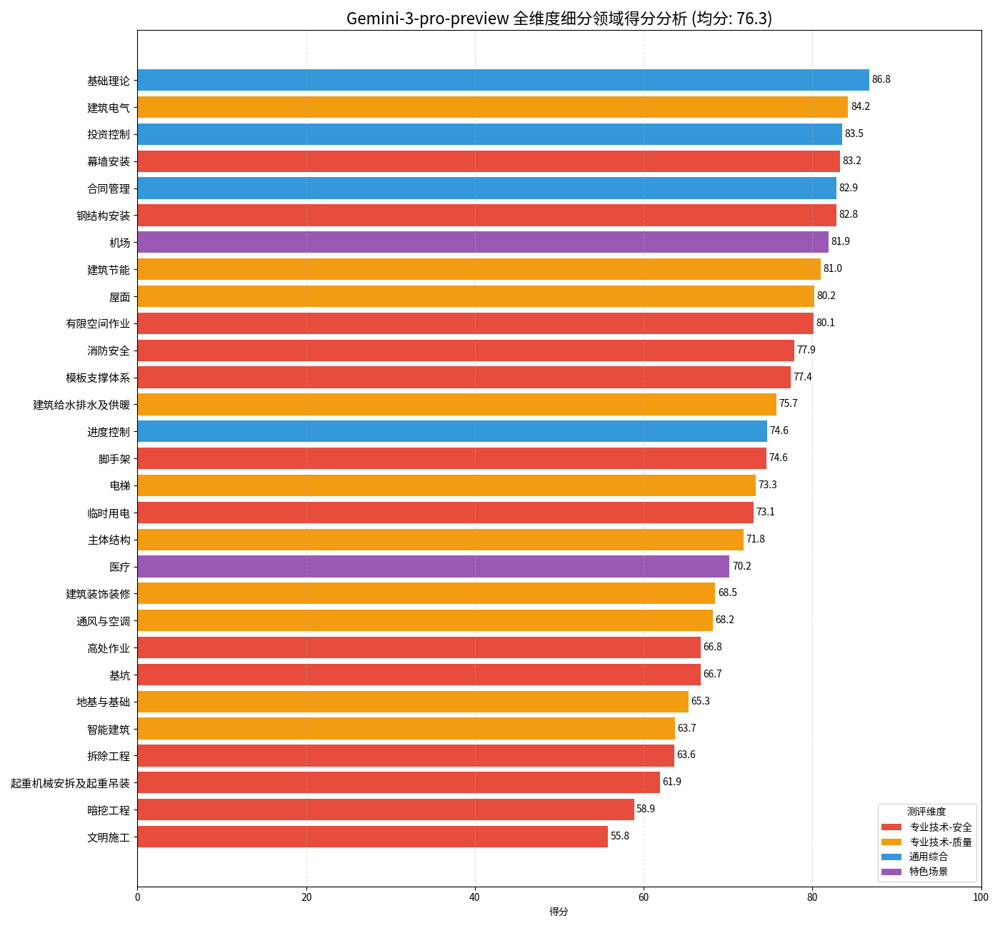
</p>

### 6. Domestic vs. Foreign Models
This section compares domestic Qwen models (32B/30B) with foreign models of similar size (GPT-OSS-20B, Gemma-4-31B-IT, Nemotron-30B-A3B) to understand capability differences under comparable parameter budgets.
- **The overall advantage comes from “Professional Technology / Quality Control”**: Qwen3-32B scores 63.56 in total, far ahead of GPT-OSS-20B (47.18) and Nemotron-30B-A3B (48.28). In “Professional Technology”, Qwen3-32B scores 59.95 vs GPT-OSS-20B/Nemotron 39.64/40.46.
- **Quality Control is the main separator**: In the 1-2 Quality dimension, Qwen3-32B scores 56.83, while GPT-OSS-20B/Nemotron score only 34.58/36.49, reflecting difficulties with Chinese codes, construction process logic, and supervision-specific language.
- **Foreign models can be competitive in “Special Scenes”**: Gemma-4-31B-IT scores 73.09 in Special Scenes, higher than Qwen3-32B’s 68.12, indicating strong general scene understanding; however, weaker professional/quality performance reduces overall usability for supervision tasks.
- **Different trade-offs within the same family**: Qwen3-30B-A3B Instruct scores 61.68, slightly higher than its Thinking variant (60.61). The Thinking variant is more stable on some sub-tasks; choose based on interaction speed vs. complex reasoning needs.

<p align="center">
  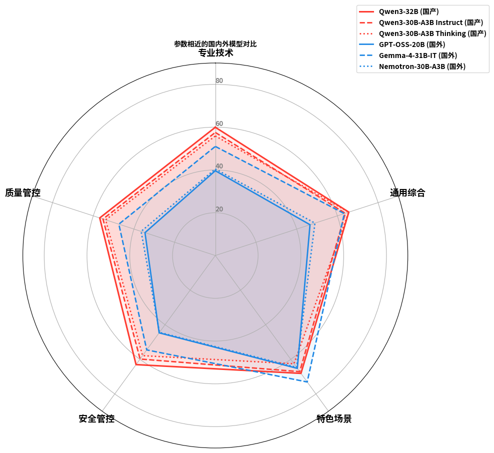
</p>
<p align="center">
  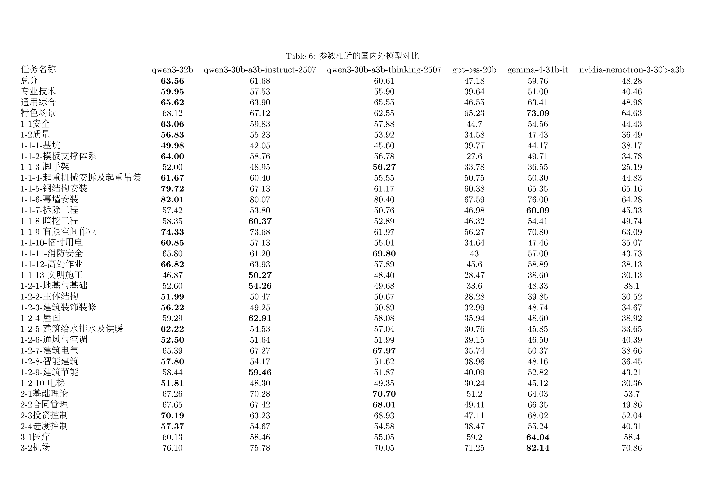
</p>

## Directory Structure
- `assets/`: Project assets (images, documents, etc.).
- `data/`: Evaluation datasets (Professional Technology, General Comprehensive, Special Scenes, etc.).
- `frame/`: Knowledge framework definitions.
- `config/`: Configuration files.
- `pipeline/`: Core processing logic.

## Installation and Usage

### 1. Install Dependencies
Ensure you have a Python environment set up, then install the required packages:
```bash
pip install -r requirements.txt
```

### 2. Run Evaluation
Run the evaluation using the default configuration (`config/test.yaml`):
```bash
python main.py
```
Or specify a custom configuration file:
```bash
python main.py --config_yaml_path config/your_config.yaml
```

### 3. Dataset Validation
Before running the evaluation, you can validate the integrity of the dataset (e.g., check if necessary question types exist for each category):
```bash
python main.py --validate_dataset
```

## Configuration
The following explains each configuration parameter using `config/example.yaml` (standard evaluation) and `config/example_heavy_think.yaml` (Heavy-Think evaluation) as references. You can copy either example to `config/test.yaml` and adjust as needed.

### 1. Standard Evaluation Config (example.yaml)
- **candidate_model**: Candidate (answering) model configuration
  - **api_key**: API key for the model service. Do not commit real keys to the repository.
  - **base_url**: Base URL of an OpenAI-compatible endpoint (or vendor-provided API endpoint).
  - **model_name**: Model identifier (as defined by the provider).
  - **max_tokens**: Maximum tokens to generate per request (affects output length and cost).
  - **temperature / top_p / top_k**: Sampling parameters. `null` means not explicitly set and the default behavior will be used.
  - **enable_thinking**: Whether to enable “thinking / reasoning” mode (only effective if the gateway/model supports it).
  - **stream**: Whether to use streaming responses (does not change the final answer, only the response delivery).
  - **max_retries**: Maximum retry attempts for transient failures (network, throttling, timeouts).
  - **concurrency**: Concurrency limit for candidate model calls in standard mode.
  - **timeout**: Per-request timeout in seconds.
  - **heavy_think**: Whether to enable the two-stage Heavy-Think pipeline (typically `false` in standard evaluation).
  - **h_think_times**: Number of repeated candidate runs in Heavy-Think stage 1 (keep `1` in standard evaluation).
  - **summary_model**: Summary/fusion model config for Heavy-Think stage 2 (can be `null` in standard evaluation).

- **judges**: Judge model list (used only for scoring Q&A questions)
  - Each element is a model config object with the same fields as `candidate_model` (api_key/base_url/model_name/max_tokens/...).
  - **concurrency**: Per-judge concurrency limit. Each judge model is rate-limited independently.

- **datasets_config_path**: Path to the dataset selection file (`.txt`)
  - Used to select which subsets/questions to evaluate. If empty or missing, the evaluator runs on all questions by default.
  - Format: one selection rule per line, with hierarchy separated by `-`. The first segment must include a module keyword (e.g., Professional Technology / General Comprehensive / Special Scenes).
    - Example: `专业技术`
    - Example: `专业技术-安全-<Safety Type>-<Safety Special>`
    - Example: `专业技术-质量-<Division Project>-<Sub-division Project>-<Sub-item Project>`
    - Example: `通用综合-<Block Type>` (e.g., Basic Theory / Contract Management / Investment Control / Schedule Control)
    - Example: `特色场景-机场-<Airport Special>` or `特色场景-医疗-<Category>-<Specialty>-<Sub-specialty>-<Fine-grained>`

- **module_1_path / module_2_path / module_3_path**: Data directories for the three modules
  - Defaults map to `data/1专业技术`, `data/2通用综合`, and `data/3特色场景`.
  - Override these when you want to evaluate a different dataset folder layout.

- **en_mode**: Whether to use English prompts / English evaluation mode
  - When `true`, English prompt templates are used for both answering and judging (useful for English datasets or English outputs).

- **result_output_path**: Output directory for evaluation artifacts
  - Contains raw model outputs, judge cache files, and aggregated results (e.g., `scores.csv`, `report.md`).

- **weights**: Scoring weights (controls how scores are aggregated)
  - **专业技术 / 通用综合 / 特色场景**: Per-module question-type weights (single-choice / multiple-choice / true-false / Q&A).
  - **安全权重 / 质量权重**: Aggregation weights within Professional Technology (Safety vs Quality).
  - **基础理论权重 / 合同管理权重 / 投资控制权重 / 进度控制权重**: Aggregation weights within General Comprehensive.
  - **医疗权重 / 机场权重**: Aggregation weights within Special Scenes.
  - **专业技术权重 / 通用综合权重 / 特色场景权重**: Weights for aggregating the three modules into the final total score (typically sums to 100).

### 2. Heavy-Think Config (example_heavy_think.yaml)
Heavy-Think evaluation uses a two-stage pipeline:
1) Stage 1: run `candidate_model` on the same question `h_think_times` times to obtain multiple candidate reasoning/answers; 2) Stage 2: construct a summary prompt from those candidates and generate the final answer with `summary_model`.

- **candidate_model.heavy_think**: Enables Heavy-Think mode (`true`).
- **candidate_model.h_think_times**: Number of repeated candidate runs in stage 1 (e.g., `3`).
- **candidate_model.summary_model**: Summary/fusion model config for stage 2
  - If `null`, the system falls back to using `candidate_model` as the summary model.
  - You can set a stronger/more stable/cheaper model here to fuse multiple candidates.
- **candidate_model.concurrency**: Concurrency limit for stage 1 candidate calls.
- **summary_model.concurrency**: Concurrency limit for stage 2 summary calls. If not set, it falls back to `candidate_model.concurrency`.

In Heavy-Think mode, raw outputs also include `heavy_think_content` (per-candidate prompt/thought/answer) and a more detailed `usage_details` breakdown (separating candidate vs summary token usage), which helps analyze the trade-off between quality gains and cost/latency.

## Evaluation Process
1. **Initialization**: Validate the availability of candidate and judge models.
2. **Data Loading**: Load the specified questions based on the configuration.
3. **Model Inference**: Concurrently call the candidate model to generate answers.
4. **Scoring**:
   - Objective questions (Single/Multi-choice, True/False): Automatically scored against standard answers.
   - Subjective questions (QA): Scored by judge models.
5. **Report Generation**: Output `scores.csv` (detailed scores) and `report.md` (analysis report).

## Notes
- `data/` and `frame/` directories contain source data and usually do not need modification.
- Results are saved in the `results/` directory (or the path specified in the config).
- If no valid judge model is configured, QA questions will not be included in the final score.

## Future Plans
This project is the first open-source evaluation benchmark attempt for the supervision industry. Please bear with any shortcomings. The SRIBS Consulting Group has plans for more evaluation sets and other AI projects in the future. For further inquiries, please contact the team at: wuhao@jkec.com.cn

## License
This project is licensed under the [CC BY-NC License](https://creativecommons.org/licenses/by-nc/4.0/). It is intended for non-commercial research use only.

## Acknowledgements
This project is released by the SRIBS Consulting Group. We hereby express our gratitude to SRIBS Consulting Group Co., Ltd., SRIBS Engineering Consulting Co., Ltd., and all colleagues who participated in the project construction.
