# “盈科·绳墨” 监理行业大模型测评集1.0

<p align="center">
  <a href="https://github.com/2719104587/MESBench">
    
  </a>
  <a href="https://www.modelscope.cn/datasets/DongZekai/Norma_MESBench_1.0">
    
  </a>
  <br>
  
</p>

## 目录
- [项目简介](#项目简介)
- [总体框架](#总体框架)
- [测评集构建方法](#测评集构建方法)
- [题目示例](#题目示例)
- [评分机制](#评分机制)
- [模型测评结果分析](#模型测评结果分析)
- [目录结构](#目录结构)
- [安装与运行](#安装与运行)
- [配置说明](#配置说明)
- [评测流程](#评测流程)
- [注意事项](#注意事项)
- [许可证 (License)](#许可证-license)
- [致谢](#致谢)

## 项目简介
Norma-MESBench 1.0是首个面向中国建设工程监理行业的万题级大语言模型多任务测评基准。该基准聚焦房屋建设领域，包含10,144道题目，覆盖专业技术、通用综合及特色场景三大分类，涵盖单选、多选、判断及问答四种题型。项目采用独创的“多层级混合评分机制”，旨在立体度量大模型在监理垂直领域的专业能力，帮助从业者评估模型回答的准确性与可靠性，填补了监理行业大模型测评基准的空白。

<p align="center">
  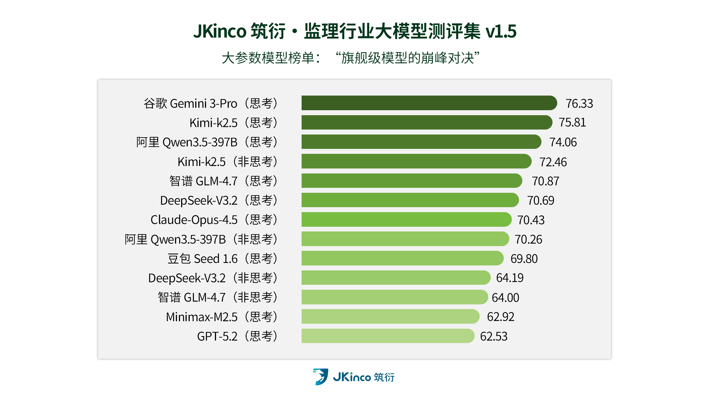
  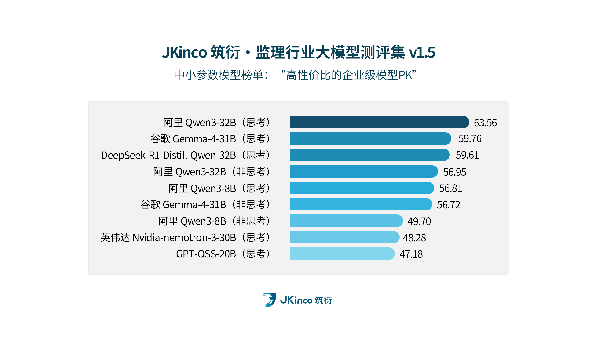
</p>

## 总体框架
为了全面衡量大语言模型在工程监理领域的专业能力，MESBench构建了包含3大板块、多个层级的立体测评结构，并依据监理工作的深度与广度将测评的颗粒度进一步细化。

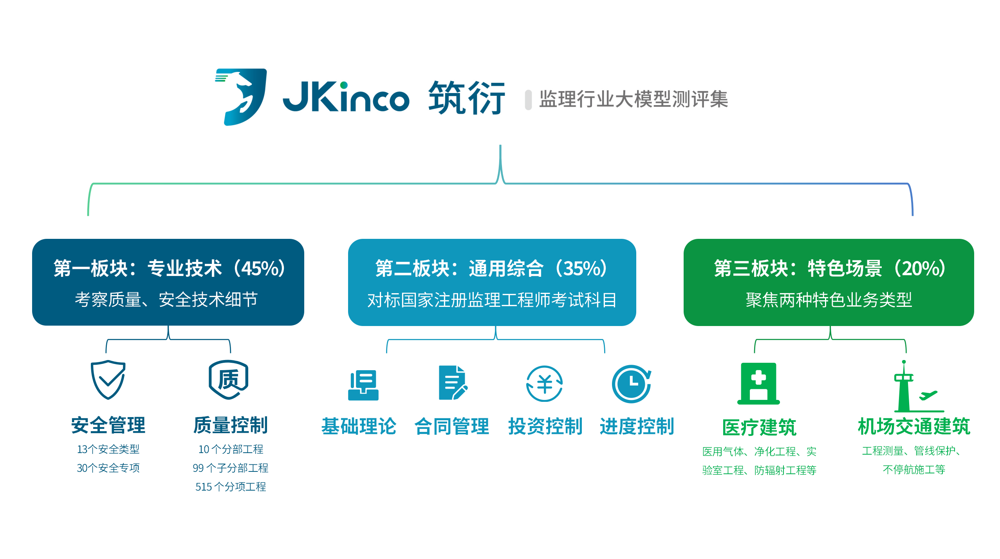

## 测评集构建方法
本项目采用“人工出题 + 大语言模型辅助出题”的混合模式构建测评集。

### 1. 人工出题
由资深监理业务人员编写，提供“场景题目”、“正确答案”、“出题依据”及“各选项”/“得分点”。

### 2. 大语言模型辅助出题
- **结合 RAG 技术合成题目**：利用 OCR、Embedding 等技术将标准规范、管理手册等技术文档转化为向量库，通过检索增强生成（RAG）技术让大模型基于准确依据出题，并经人工复核。
- **结合提示词工程进行场景化改写**：针对国家注册监理工程师考试科目的真题、习题，通过打乱选项、场景化改写等方式减少模型“背题”现象，考察实际解决问题的能力。

### 3. 测评集题目质量控制
- **格式统一**：通过脚本将所有题目转化为统一 JSON 格式。
- **题目去重**：基于语义匹配和向量相似度计算进行去重。
- **分布检查**：确保各最小评估单元题目数量充足。测评集共 10,144 题，其中单选题 4,669 题、多选 3,709 题、判断 1,271 题、问答 495 题。
- **人工复核**：聚焦主流模型共同错题，及时替换有质量缺陷的题目。

## 题目示例
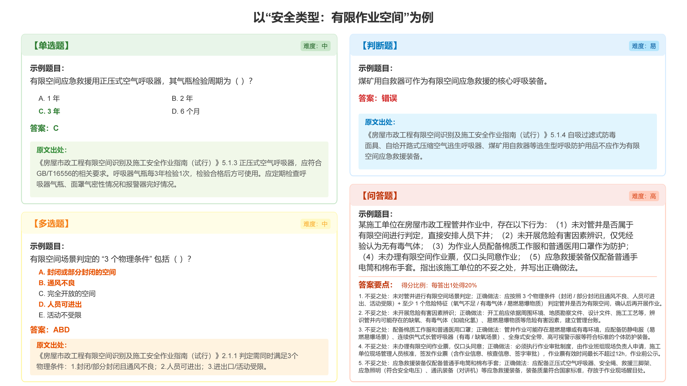

### 题目格式示例
```json
    {
        "id": "45",
        "领域": "质量",
        "分部工程": "地基与基础",
        "子分部工程": "地下水控制",
        "分项工程": "降水与排水",
        "题型": "单选题",
        "问题": "分层、分块开挖的土质基坑，开挖前潜水水位应控制在土层开挖面以下多少范围\nA. 1.5m～2.0m\nB. 1.0m～1.5m\nC. 0.5m～1.0m\nD. 0.3m～0.5m\n",
        "答案": "C"
    },
```

## 评分机制
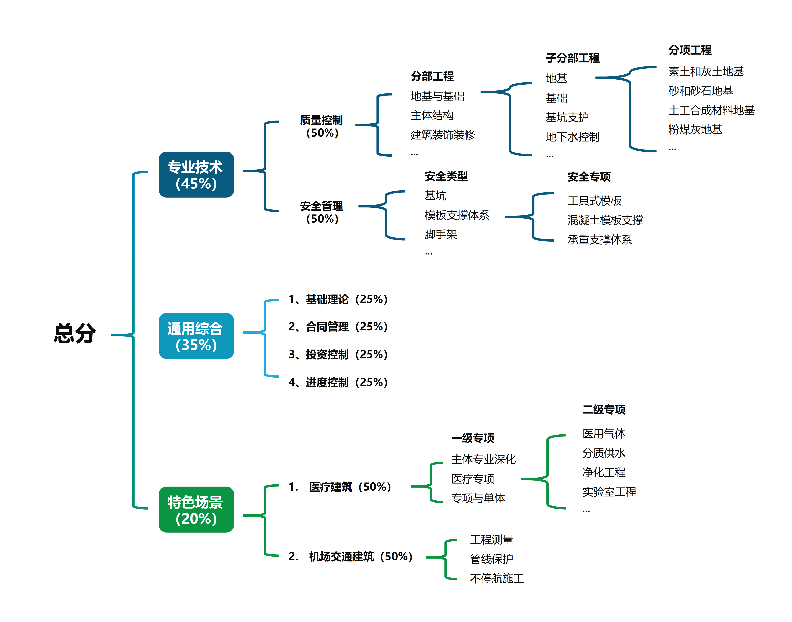

### 1. 整体计算逻辑
为了科学评估模型在监理各细分领域的专业水平，本项目提出“多层级多题型混合评分机制”。

#### 总分计算
总分由三大板块加权求和得出：

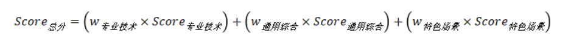

#### 板块一：专业技术 (权重 0.45)
由“安全管理”和“质量控制”各占 50% 构成。
- **安全管理**：分层计算“安全专项”与“安全类型”得分。
- **质量控制**：分层计算“分项工程”、“子分部工程”、“分部工程”得分。

#### 板块二：通用综合 (权重 0.35)
包含“基础理论”、“合同管理”、“投资控制”、“进度控制”四个子版块，各占 25%。

#### 板块三：特色场景 (权重 0.2)
由“医疗建筑”和“机场交通建筑”各占 50% 构成，深入评估医疗建筑、机场交通建筑2个特色项目类型中区别于传统房建监理项目的高壁垒知识点的知识储备。

### 2. 标准化答题模式
采用 Zero-shot 和生成式测评，不提供解题模板，仅限制输出格式。

### 3. 各题型评分机制
- **客观题**（单选/多选/判断）：比对标准答案，计算正确率 (Accuracy)。
- **主观题**（问答）：采用“拆分得分点 + 大模型裁判组”机制。由 kimi-k2-thinking、deepseek-r1、qwen3-235b-a22b-thinking-2507 组成裁判组，根据得分点独立打分后取平均值。

## 模型测评结果分析

### 1. 主流大语言模型选取
本次测评选取了14个主流大语言模型（含开启/关闭深度思考的同一模型），参数量涵盖 20B 至超 100B，包括开源和闭源模型。
| 模型名称 | 是否开启深度思考 | 参数大小 | 是否开源 |
| :--- | :--- | :--- | :--- |
| qwen3-30b-a3b-thinking-2507 | 是 | 30B (总), 3B (激活) | 是 |
| qwen3-30b-a3b-instruct-2507 | 否 | 30B (总), 3B (激活) | 是 |
| qwen3-32b | 是 | 32B | 是 |
| qwen3-32b | 否 | 32B | 是 |
| qwen3-235b-a22b-thinking-2507 | 是 | 235B (总), 22B (激活) | 是 |
| qwen3-max | 否 | 1T (总), 220B (激活) | 否 |
| deepseek-r1-distill-qwen-32b | 是 | 32B | 是 |
| glm-4.7 | 是 | 358B (总), 32B (激活) | 是 |
| glm-4.7 | 否 | 358B (总), 32B (激活) | 是 |
| kimi-k2 | 是 | 1T (总), 32B (激活) | 是 |
| doubao-seed-1.6 | 是 | 230B (总), 23B (激活) | 否 |
| deepseek-v3.2 | 是 | 671B (总), 37B (激活) | 是 |
| deepseek-v3.2 | 否 | 671B (总), 37B (激活) | 是 |
| deepseek-r1 | 是 | 671B (总), 37B (激活) | 是 |
| gpt-oss-20b | 是 | 20B | 是 |
| gpt-oss-120b | 是 | 120B | 是 |
| nvidia-nemotron-3-30b-a3b | 是 | 30B (总), 3B (激活) | 是 |

### 2. 大参数模型测评榜单
对参数量超 1000 亿的模型进行对比。除 Qwen3-Max 和 doubao-seed-1.6 外均为开源。
- **第一梯队咬合紧密**：Kimi-k2（深度思考）以 73.52 分险胜，DeepSeek-v3.2（深度思考）和 Qwen3-Max（非深度思考）紧随其后。前六名分差极小。
- **个别模型掉队**：GPT-OSS-120B作为国外模型和其他大参数模型表现出较大差距，DeepSeek-R1作为24年12月的旧模型和其他最新版本的国产大参数模型相比表现不佳。

<p align="center">
  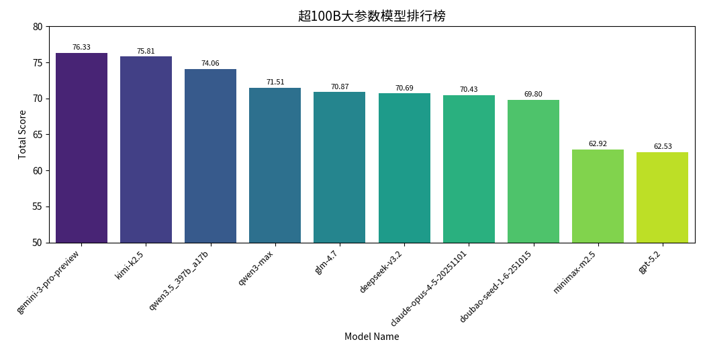
</p>
<p align="center">
  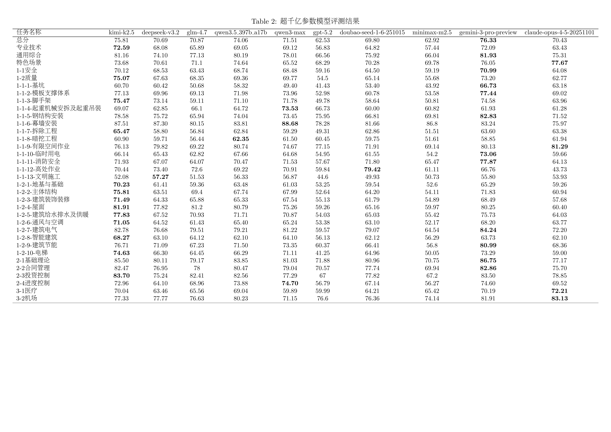
</p>

### 3. 中小参数模型测评榜单
对 20B-32B 参数量的开源模型进行对比，适合资源有限的企业本地部署。
- **越级表现**：Qwen3-32B（深度思考）得分 65.63，超越所有中小参数模型及部分大参数模型，性价比极高。
- **水土不服**：nvidia-nemotron-3-30b-a3b 和 gpt-oss-20b 在中文监理领域表现不佳。

<p align="center">
  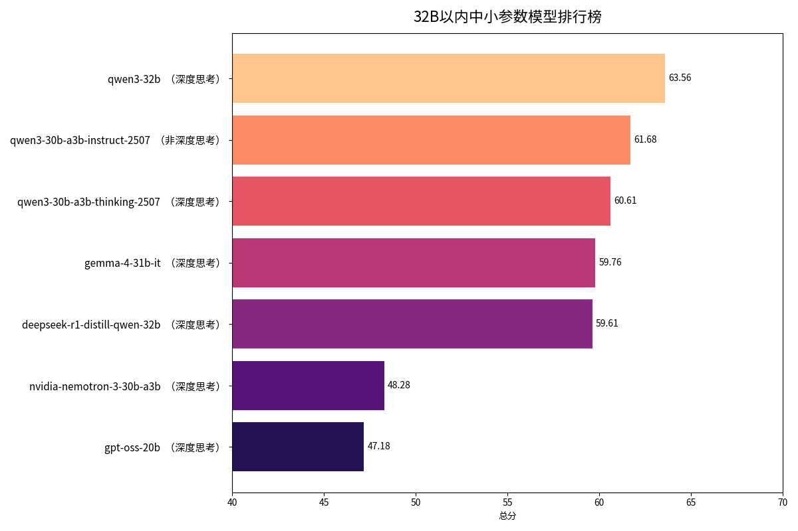
</p>
<p align="center">
  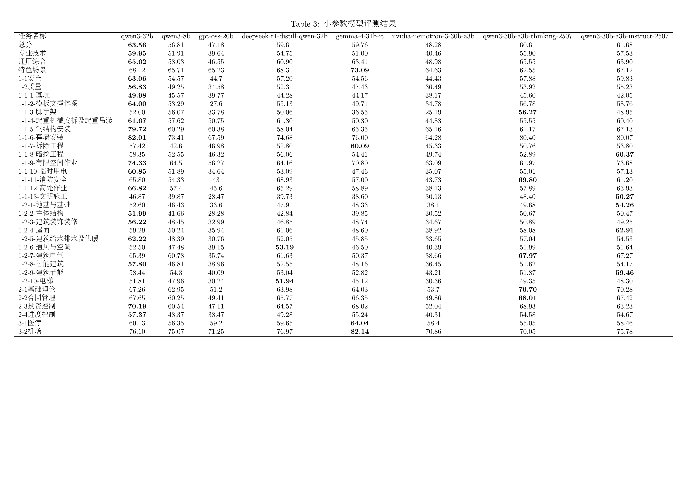
</p>

### 4. 思考模式对比非思考模式
所有模型开启“深度思考（CoT）”后得分显著增长。
- **显著提升**：DeepSeek-v3.2 提升最明显（+7.5分），证明 CoT 在监理领域的必要性。
- **“慢思考”代价**：CoT 会降低响应速度，需视场景权衡。

<p align="center">
  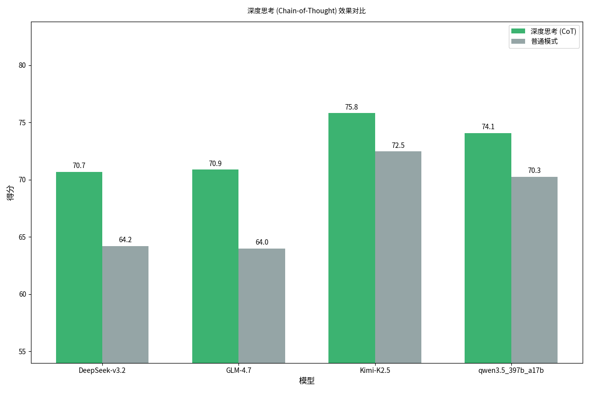
</p>
<p align="center">
  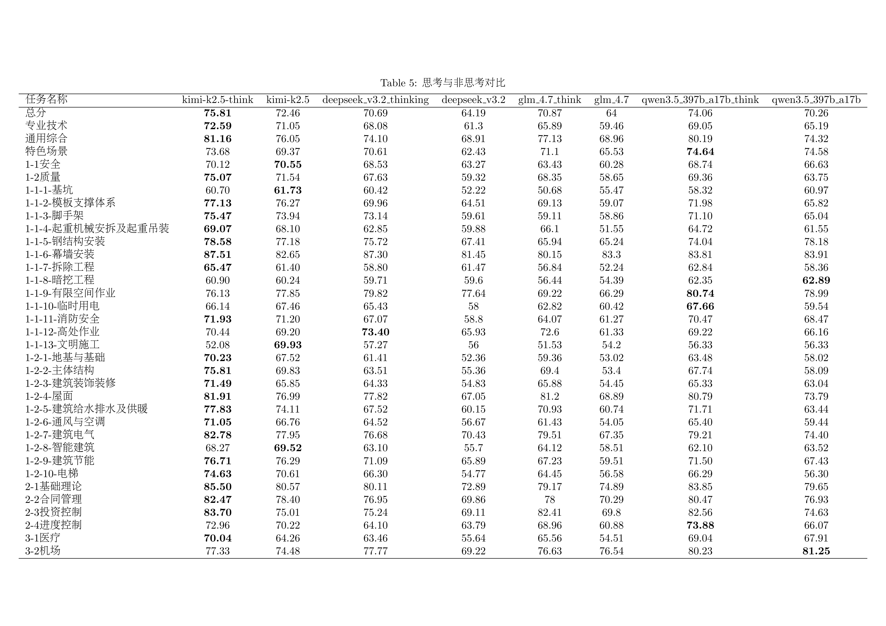
</p>

### 5. 不同细分领域得分对比（以 Kimi-k2 为例）
- **专业技术**：“质量”（~71.5）优于“安全”（~67.1）。
- **通用综合**：均分 ~79.4，为最强板块。得益于大模型的文本理解和逻辑归纳能力，以及潜在的公开真题训练数据。

<p align="center">
  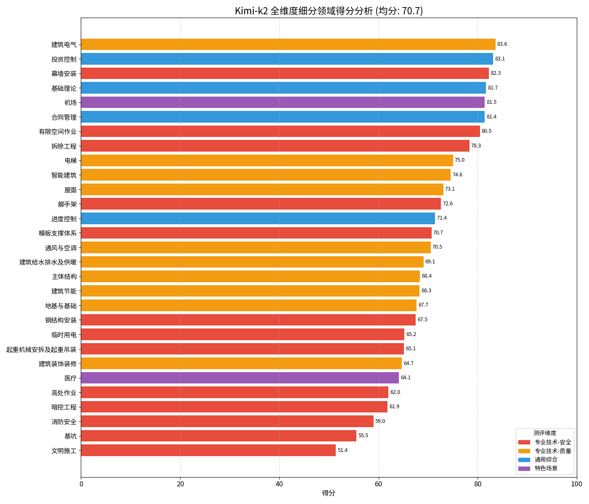
</p>

### 6. 国内模型对比国外模型
对比 Qwen3-32B 与国外同级模型（Nemotron-30B, GPT-OSS-20B）。
- **全面碾压**：Qwen3-32B 在所有维度胜出。
- **专业壁垒**：国外模型在“专业技术”板块几乎无法处理中国监理规范，证明了国外模型在监理这一垂直领域的壁垒。

<p align="center">
  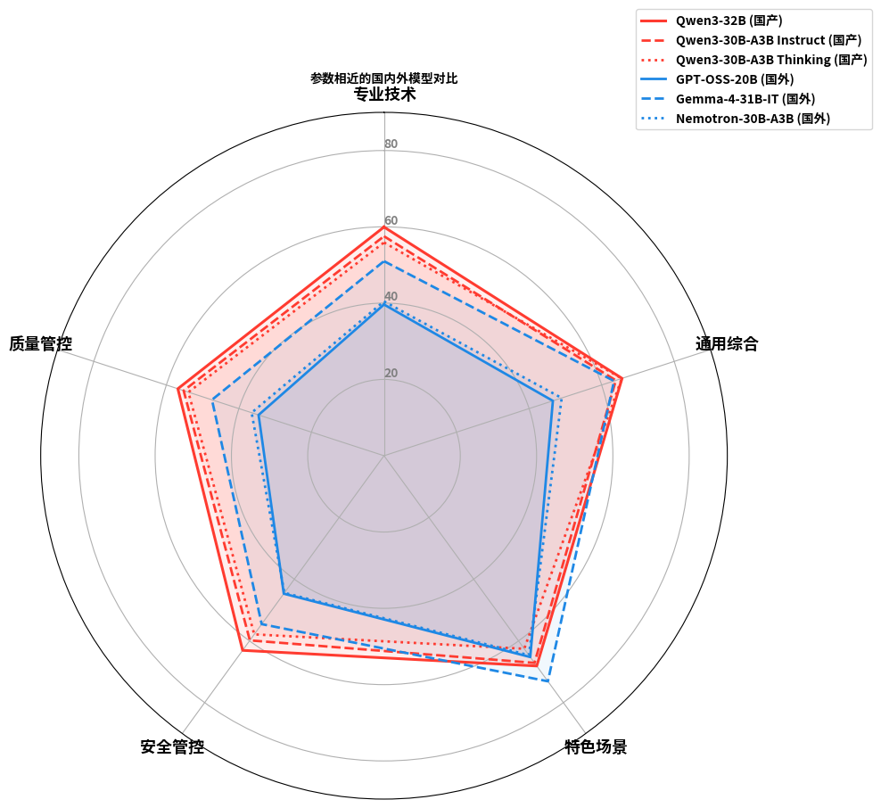
</p>
<p align="center">
  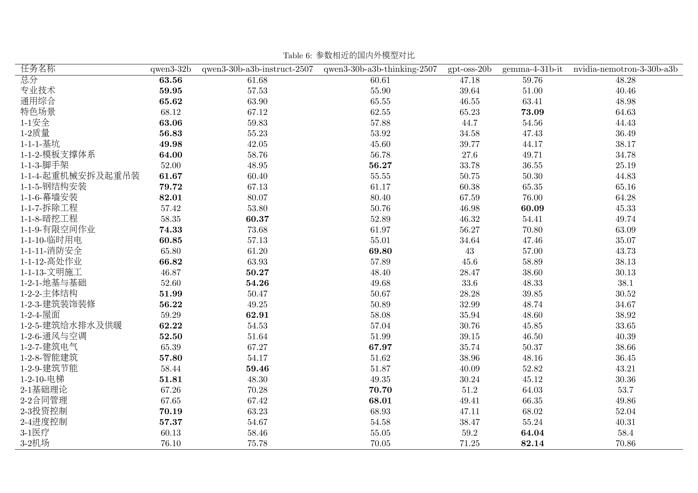
</p>

## 目录结构
- `assets/`: 项目相关资产（如图片、文档）
- `data/`: 评测数据集（包含专业技术、通用综合、特色场景等）
- `frame/`: 知识体系框架定义
- `config/`: 配置文件
- `pipeline/`: 核心处理逻辑

## 安装与运行

### 1. 安装依赖
请确保已安装 Python 环境，并执行以下命令安装所需依赖：
```bash
pip install -r requirements.txt
```

### 2. 运行评测
默认使用 `config/test.yaml` 配置文件进行评测：
```bash
python main.py
```
或者指定配置文件路径：
```bash
python main.py --config_yaml_path config/your_config.yaml
```

### 3. 数据集校验
在运行评测前，可以对数据集的完整性进行校验（例如检查各分类下是否包含必要的单选、多选、判断及问答题）：
```bash
python main.py --validate_dataset
```

## 配置说明
配置文件（如 `config/test.yaml`）包含以下主要部分：
- **candidate_model**: 待评测模型参数（api_key, base_url, model_name 等）。
- **judges**: 裁判模型参数列表（用于对问答题进行评分）。
- **datasets_config_path**: 评测集选择文件路径（.txt），指定需要评测的题目范围。
- **result_output_path**: 结果输出目录。
- **weights**: 各类题型的分值权重设置。

## 评测流程
1. **初始化**: 验证待评测模型与裁判模型的可用性。
2. **加载数据**: 根据配置加载指定的评测题目。
3. **模型作答**: 并发调用待评测模型，生成答案。
4. **评分统计**:
   - 客观题（单选/多选/判断）：根据标准答案自动评分。
   - 主观题（问答）：使用裁判模型组进行打分。
5. **报告生成**: 输出 `scores.csv`（详细分数）与 `report.md`（分析报告）。

## 注意事项
- `data/` 与 `frame/` 目录为数据源，通常不需要修改。
- 评测结果会保存在 `results/` 目录下（或配置文件指定的路径）。
- 如果未配置有效的裁判模型，问答题将不计入最终分数。

## 项目后续规划
本项目是首个针对监理行业的开源测评基准项目尝试，不足之处请多包涵。上海建科咨询团队后续还有更多测评集和其他AI项目的规划，如有其他咨询需要，团队联系方式：wuhao@jkec.com.cn

## 许可证 (License)
本项目遵循 [CC BY-NC License](https://creativecommons.org/licenses/by-nc/4.0/) 授权，仅限非商业研究使用。

## 致谢
本项目由上海建科咨询团队发布，在此向上海建科咨询集团、上海建科工程咨询有限公司及所有参与项目建设的同事致谢。
